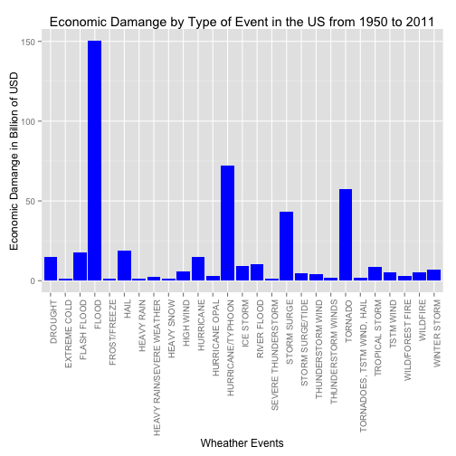

#Synopsis
The main objective of the present analysis is to determine which kind of Severe Wheater Event has caused the most damange in the United States from 1950 to 2011. The level of damange is accessed from the public health perspective and from the economic perspective. The dataset with the wheather events registered during this period was obtained from the US. National Oceanic and Atmospheric Administration's (NOAA) database.

The conclusion of the analysis is that **floods** have caused the highest economic damange while **tornados** have caused the most damage to the public health.

The following sections of this document show the details of the analysis and the results.

##Preliminary Data Processing Requierements
For this data analysis, the following R packages are required:

- knitr
- dplyr
- ggplot2
- reshape2


```r
require(knitr)
require(dplyr)
require(ggplot2)
require(reshape2)
opts_chunk$set(echo=TRUE,cache=TRUE)
```
##Main Questions of the Analysis
This analysis try to respond the following questions:

1) Accross the United States, which types of events are most harmful with respect to population health?
2) Accross the United States, which types of events have the greatest economic consequences?

#Data Processing

The data is downloaded from the Course website as a zip file. The URL is

https://d396qusza40orc.cloudfront.net/repdata%2Fdata%2FStormData.csv.bz2

The following code chunk downloads the data and decompresses the file. The final file is a csv file:


```r
if(!file.exists("./data")) dir.create("data") #The data will be stored inside a directory named data in your working directory for this project

if(!file.exists("./data/storm_data.csv.bz2"))
        download.file(url='https://d396qusza40orc.cloudfront.net/repdata%2Fdata%2FStormData.csv.bz2',destfile="./data/storm_data.csv.bz2",method="curl")

data <- read.csv('./data/storm_data.csv.bz2')
```

Now that the data is loaded, and looking to answer the first question about the impact of the wheather events to the public health, a new dataframe will be built and named **fat_evtype**. This dataframe summarizes the number of fatalities per wheather event type. From the stom data set loaded before, the variable **EVTYPE** provides the **Event Type classification** and the variable **FATALITIES** provides the number of **Fatalities** on each event recoreded in the dataset. Similarly, using the variable **INJURIES** it can be summarized the number of people injured per type of event. The numer of people injured per type of event will be summarized in a dataframe named **inj_evtype**.

Finally both dataframes (fat_evtype and inj_evtype) will be merged into a dataframe named **human_dmg** which contains the number of fatalities and injuries per wheather event.


```r
fat_evtype <- aggregate(FATALITIES ~ EVTYPE, data=data, sum)
inj_evtype <- aggregate(INJURIES ~ EVTYPE, data=data, sum)
human_dmg <- merge(fat_evtype,inj_evtype, by.x="EVTYPE", by.y="EVTYPE")
head(human_dmg)
```

```
##                  EVTYPE FATALITIES INJURIES
## 1    HIGH SURF ADVISORY          0        0
## 2         COASTAL FLOOD          0        0
## 3           FLASH FLOOD          0        0
## 4             LIGHTNING          0        0
## 5             TSTM WIND          0        0
## 6       TSTM WIND (G45)          0        0
```

Now, in order to address the question of which wheather event is most harmful to public health, the most harmful event will be selected as the event with the higher amount of fatalities and higher amount of injuries. 


```r
top_dmg <- filter(human_dmg,FATALITIES>100 & INJURIES>100)
#To focus in the top damage events, this filtering is selecting the events with at least 100 fatalities and at least 100 people injured. The result is stored in a dataframe named top_dmg
top_dmg
```

```
##               EVTYPE FATALITIES INJURIES
## 1          AVALANCHE        224      170
## 2           BLIZZARD        101      805
## 3     EXCESSIVE HEAT       1903     6525
## 4       EXTREME COLD        160      231
## 5        FLASH FLOOD        978     1777
## 6              FLOOD        470     6789
## 7               HEAT        937     2100
## 8          HEAT WAVE        172      309
## 9         HEAVY SNOW        127     1021
## 10         HIGH SURF        101      152
## 11         HIGH WIND        248     1137
## 12         LIGHTNING        816     5230
## 13       RIP CURRENT        368      232
## 14      RIP CURRENTS        204      297
## 15       STRONG WIND        103      280
## 16 THUNDERSTORM WIND        133     1488
## 17           TORNADO       5633    91346
## 18         TSTM WIND        504     6957
## 19      WINTER STORM        206     1321
```

For the question #2, about which wheather event caused the most economic damange, the variables PROPDMG, PROPDMGEXP, CROPDMG, CROPDMGEXP will be used. These variables have the dollar ammount of damages to property and to crops, so we will calculate the following new variables for the dataframe:

- PROPDMG_DOLLARS: this will contain the amount in dollars of the property damage of each event registered in the dataset. In order to obtain the dollar amount the PROPDMG and the PROPDMGEXP variables must be examinated in order to multiply the PROPDMG amount by the proper multiple. The multiple is especify in the PROPDMGEXP variable by the letters "K" for thousand of dollars, "M" for million of dollars, and "B" for billions of dollars.

- CROPDMG_DOLLARS: folloging a simmilar procedure as for the building of the PROPDMG_DOLLARS variable, this new variable will contain the dollar amount of the damage caused to crops by each event registered in the dataset.

- TOTAL_DMG_DOLLARS: will be the sum of PROPDMG_DOLLARS and CROPDMG_DOLLARS. This will show the dollar amount of the total economic damange done by each event.


```r
data$PROPDMG_DOLLARS <- ifelse(data$PROPDMGEXP=="K",data$PROPDMG*1000,ifelse(data$PROPDMGEXP=="M",data$PROPDMG*1000000,ifelse(data$PROPDMGEXP=="B",data$PROPDMG*1000000000,data$PROPDMG)))

data$CROPDMG_DOLLARS <- ifelse(data$CROPDMGEXP=="K",data$CROPDMG*1000,ifelse(data$CROPDMGEXP=="M",data$CROPDMG*1000000,ifelse(data$CROPDMGEXP=="B",data$CROPDMG*1000000000,data$CROPDMG)))

data$TOTAL_DMG_DOLLARS <- data$PROPDMG_DOLLARS + data$CROPDMG_DOLLARS
```

Now that we have these 3 new variables, we can calculate a new dataframe named **economic_dmg** with the total dollar amount of economic damage per type of wheather event registered between 1950 to 2011.


```r
economic_dmg <- aggregate(TOTAL_DMG_DOLLARS ~ EVTYPE,data=data,sum)
#The following is in order to express the economic damage in Billions of USD
economic_dmg$TOTAL_DMG_DOLLARS <- economic_dmg$TOTAL_DMG_DOLLARS/1000000000
```


#Results
The results of the analysis addressing each of the questions are presented as follow:

###1) Accross the United States, which types of events are most harmful with respect to population health?

From the **Data Processing** section we obtained the dataframe **top_dmg** which contain the summary of the wheather events that caused at least 100 fatalities and at least 100 people injured from 1950 to 2011. Now we can make a graph in order to visualize the results obtained in this data frame.


```r
#here, using the melt() function from reshape2 library, we are building a new dataframe that has a factor variable of fatalities and injuries. This will enable us to make a pannel plot of fatalities and injuries by type of wheather event.
top_dmg_molten <- melt(top_dmg,id="EVTYPE")
head(top_dmg_molten)
```

```
##           EVTYPE   variable value
## 1      AVALANCHE FATALITIES   224
## 2       BLIZZARD FATALITIES   101
## 3 EXCESSIVE HEAT FATALITIES  1903
## 4   EXTREME COLD FATALITIES   160
## 5    FLASH FLOOD FATALITIES   978
## 6          FLOOD FATALITIES   470
```

```r
p <- ggplot(top_dmg_molten, aes(x=factor(EVTYPE), y=value, fill=variable)) + geom_bar(stat="identity",position="identity") + theme(axis.text.x = element_text(angle=90, hjust=1))
p <- p + facet_grid(variable~.)
p <- p + ggtitle("Damage of Severe Wheather Events in the US from 1950 to 2011")
print(p)
```

 

####Answer to Question 1
From this graph it can be concluded that the event with more fatalities and people injured it the **TORNADO**

###2) Across the United States, which types of events have the greatest economic consequences?

From the **Data Processing** section we obtained the dataframe **economic_dmg** with the total dollar amount (expressed in Billions of USD) of the damage caused by each type of wheather event registered in the dataset from 1950 to 2011.

Now we can filter this dataframe (economic_dmg) by the top events causing the most economic damage. This will be done by filtering the event type by the ones that caused at least 1 billion dollars.

Finally a graph will be constructed with these top damages events in order to see which event caused the maximum damage.


```r
#Remember that the variable TOTAL_DMG_DOLLARS is expressed in Billions of USD. See the calculations in the Data Processing Section.
top_econ_dmg <- filter(economic_dmg,TOTAL_DMG_DOLLARS > 1)
top_econ_dmg
```

```
##                        EVTYPE TOTAL_DMG_DOLLARS
## 1                     DROUGHT         15.018672
## 2                EXTREME COLD          1.360710
## 3                 FLASH FLOOD         17.562129
## 4                       FLOOD        150.319678
## 5                FROST/FREEZE          1.103566
## 6                        HAIL         18.752905
## 7                  HEAVY RAIN          1.427648
## 8   HEAVY RAIN/SEVERE WEATHER          2.500000
## 9                  HEAVY SNOW          1.067242
## 10                  HIGH WIND          5.908618
## 11                  HURRICANE         14.610229
## 12             HURRICANE OPAL          3.161846
## 13          HURRICANE/TYPHOON         71.913713
## 14                  ICE STORM          8.967041
## 15                RIVER FLOOD         10.148404
## 16        SEVERE THUNDERSTORM          1.205560
## 17                STORM SURGE         43.323541
## 18           STORM SURGE/TIDE          4.642038
## 19          THUNDERSTORM WIND          3.897964
## 20         THUNDERSTORM WINDS          1.924110
## 21                    TORNADO         57.340614
## 22 TORNADOES, TSTM WIND, HAIL          1.602500
## 23             TROPICAL STORM          8.382237
## 24                  TSTM WIND          5.038936
## 25           WILD/FOREST FIRE          3.108626
## 26                   WILDFIRE          5.060587
## 27               WINTER STORM          6.715441
```

```r
pe <- ggplot(top_econ_dmg, aes(x=factor(EVTYPE),y=TOTAL_DMG_DOLLARS)) + geom_bar(stat="identity",fill="blue") + theme(axis.text.x = element_text(angle=90, hjust=1))
pe <- pe + xlab("Wheather Events") + ylab("Economic Damange in Billion of USD") + ggtitle("Economic Damange by Type of Event in the US from 1950 to 2011")
print(pe)
```

 

####Answer to Question 2
From the last graph it can be concluded that the type of wheather event that caused the highest economic damage from 1950 to 2011 was the **FLOOD**.
